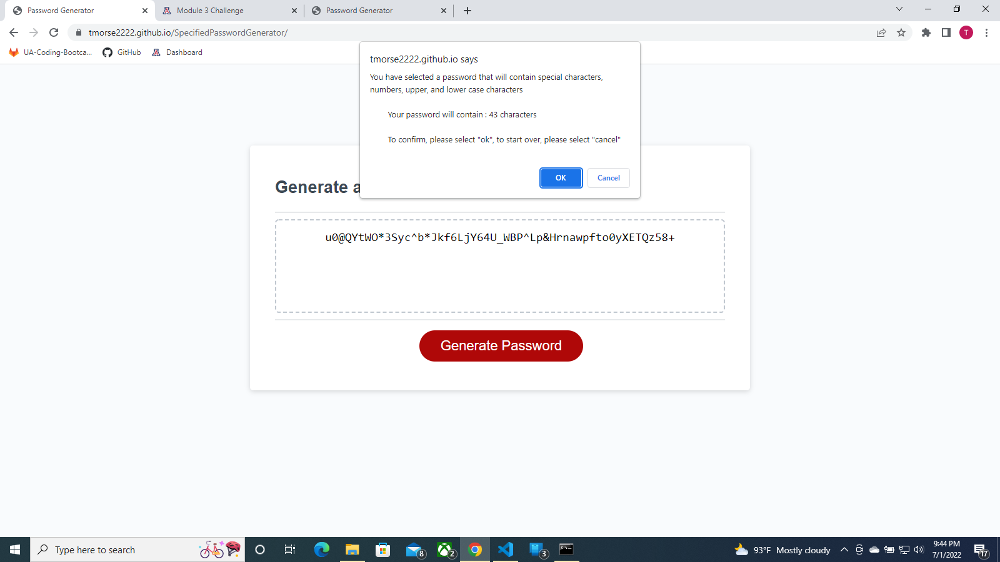

Tyler Morse 
Challenge 3: Password Generator 
Start Date: 07/01/22 
Most Recent Edit: 07/01/22 

 
User Story: 
AS AN employee with access to sensitive data 
I WANT to randomly generate a password that meets certain criteria 
SO THAT I can create a strong password that provides greater security 
 
Acceptance Criteria: 
GIVEN I need a new, secure password 
WHEN I click the button to generate a password 
THEN I am presented with a series of prompts for password criteria 
WHEN prompted for password criteria 
THEN I select which criteria to include in the password 
WHEN prompted for the length of the password 
THEN I choose a length of at least 8 characters and no more than 128 characters 
WHEN asked for character types to include in the password 
THEN I confirm whether or not to include lowercase, uppercase, numeric, and/or special characters 
WHEN I answer each prompt 
THEN my input should be validated and at least one character type should be selected 
WHEN all prompts are answered 
THEN a password is generated that matches the selected criteria 
WHEN the password is generated 
THEN the password is either displayed in an alert or written to the page 
 
This challenge is utilizes JavaScript basics to take an existing code and create a working password generator. Although only trivial changes were made to sourcing in our HTML and CSS documents, our JS script is heavily modified and the main feature of this project.

A link to the deployed application can be found <a href="file:///C:/Users/Tyler/BootCamp/SpecifiedPasswordGenerator/index.html" target=blank>here</a>